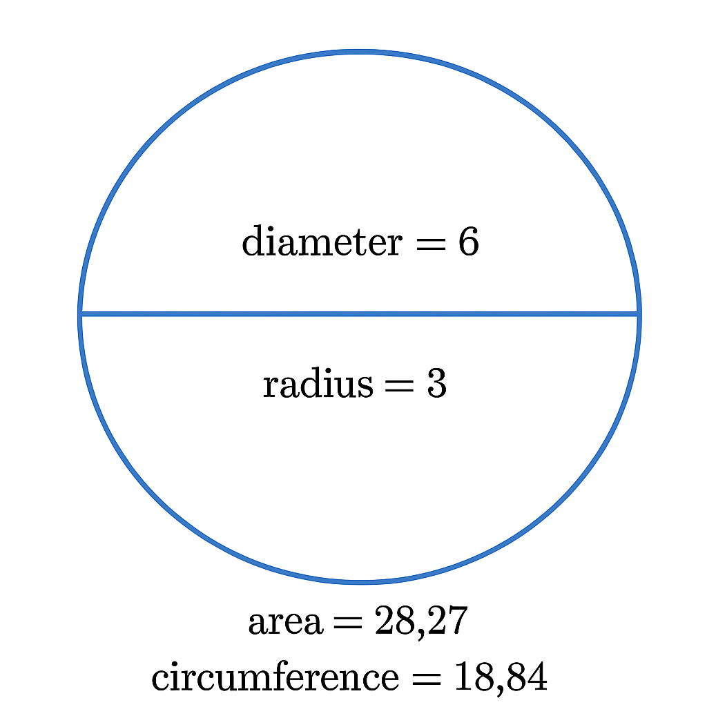

# flright_tracker
My house is 3 miles from the airport.

# Building the Zone

- **Radius**: r = 3 miles
- **Diameter**: Diameter = 2 × 3 = 6 miles

## Circumference

Circumference = 2 × π × 3 ≈ 6 × 3.1416 ≈ **18.85 miles**

## Area

Area = π × 3² = π × 9 ≈ 3.1416 × 9 ≈ **28.27 square miles**

