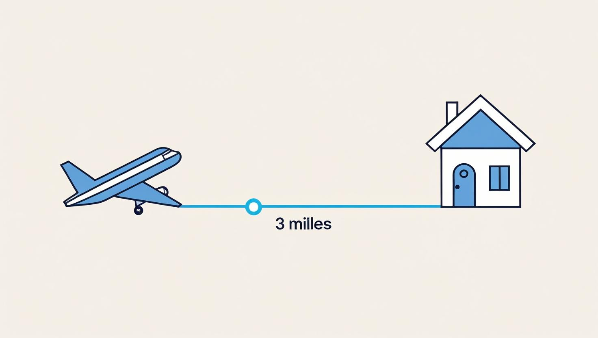

# flright_tracker
## Background
My house is about 3 miles from the airport, and I often hear or see planes directly overhead. I’m using this 3-mile range as a reference point for building the zone—it’s likely the area where aircraft activity is most noticeable to ne. 

# Building the Zone

- **Radius**: r = 3 miles
- **Diameter**: d = 2 × 3 = 6 miles
- **Circumference** = 2 × π × 3 ≈ 6 × 3.1416 ≈ **18.85 miles**
- **Area** = π × 3² = π × 9 ≈ 3.1416 × 9 ≈ **28.27 square miles**

# Research on the Local Airport
The airport near me is quite small with just 5 commercial airlines: Delta, United, American, Allegiant, and Spirit with 14 total routes divided amongst 9 states. The airport underwent renovation recently. It has 8 gates; 2 runways; a parking garage (with a level of rental cars), a short term lot, 2 long term lot containing a Tesla supercharter station and EV charger station, a cellphone lot; a baggage claim, one security checkpoint; and an area of 950 acres (390 hectares).