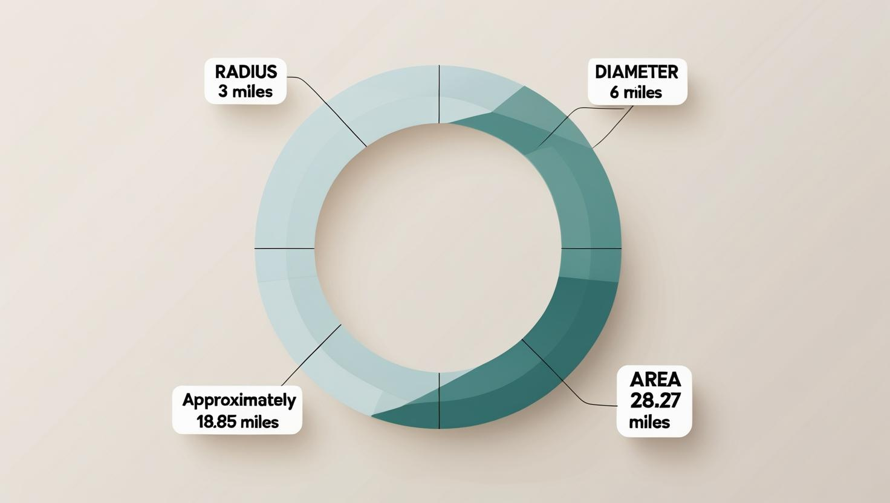

# flight_tracker
## Background
My house is about 3 miles from the airport, and I often hear or see planes directly overhead. I’m using this 3-mile range as a reference point for building the zone—it’s likely the area where aircraft activity is most noticeable to me. 

## Building the Zone

- **Radius**: r = 3 miles
- **Diameter**: d = 2r -> 2 × 3 = **6 miles**
- **Circumference** = 2πr -> 2rπ -> d × π  -> 6 × 3.1416 ≈ **18.85 miles**
- **Area** = πr² -> π × 3² -> ≈ 3.1416 × 9 ≈ **28.27 square miles**

## Research on the Local Airport
The airport near me is quite small with just 5 commercial airlines: Delta, United, American, Allegiant, and Spirit with 14 total routes divided amongst 9 states. The airport underwent renovation recently. It has 8 gates; 2 runways; 1 parking garage (with a level of rental cars), 1 short term lot, 2 long term lots containing a Tesla supercharger station and an EV charging station, 1 cellphone lot; 1 baggage claim area; 1 security checkpoint; and an area of 950 acres (390 hectares).